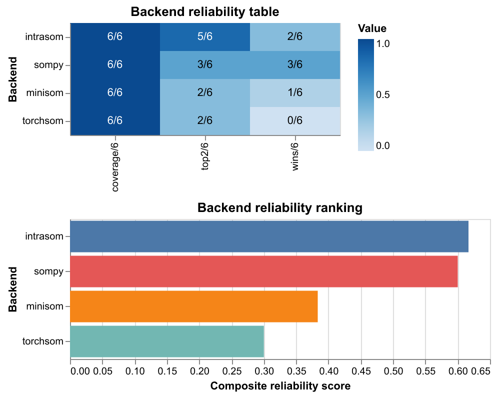
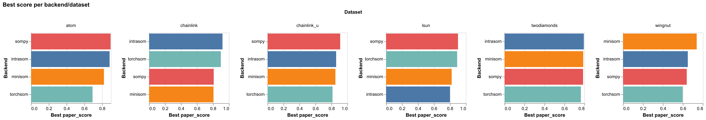
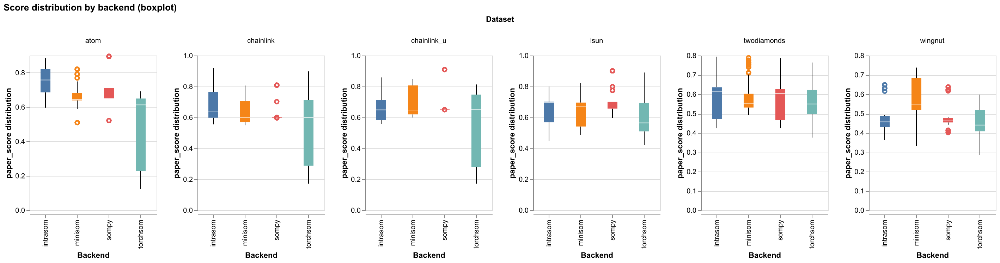
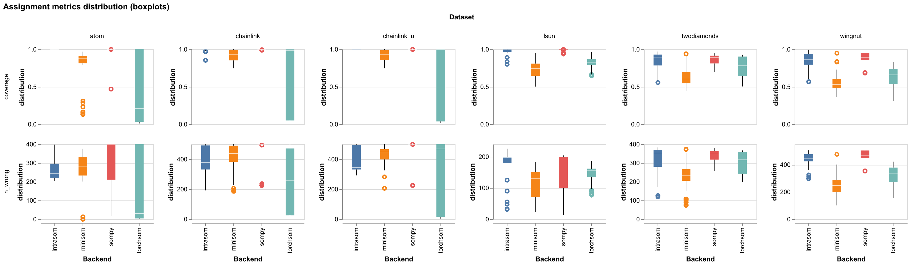
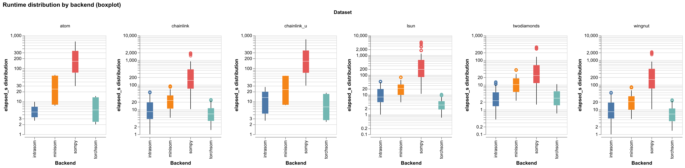

# Tuning results

This folder holds the raw hyperparameter sweep results and figures produced by
[`tuning/analyze_altair.py`](../analyze_altair.py).

## What was benchmarked

Backends: **intrasom**, **minisom**, **sompy**, **torchsom**.

The goal is to reproduce the U\*F clustering results reported by **Moutarde & Ultsch (2005)** on datasets from the [Fundamental Clustering Problems Suite (FCPS)](https://cran.r-project.org/package=FCPS). The columns "M&U wrong" and "M&U unassigned" are the target values from that paper:

| Dataset | n | k | M&U wrong | M&U unassigned |
|---|---|---|---|---|
| atom | 800 | 2 | 0 | 0 |
| chainlink | 1000 | 3 | 0 | 55 |
| chainlink\_u | 1000 | 2 | 0 | 0 |
| lsun | 404 | 3 | 0 | 5 |
| twodiamonds | 800 | 2 | 0 | 71 |
| wingnut | 1016 | 2 | 0 | 89 |

`chainlink` and `chainlink_u` are the same dataset evaluated with U\*F on U\* and on the plain U-matrix respectively (Moutarde & Ultsch, 2005, sections 3.2 and 3.3).

The sweep varied grid size, epochs/iterations, pareto fraction, threshold anchor, and number of threshold steps. Each TSV file is one backend/dataset combination; together they contain ~4900 runs.

## Score definition

**paper\_score** is a composite (0-1) meant to approximate how close a result is to the published Moutarde & Ultsch numbers:

```
paper_score = 0.4 * purity + 0.3 * coverage + 0.3 * k_score
```

where `k_score` is 1.0 if the number of clusters matches the paper exactly and decreases linearly otherwise.

## Results overview

### Backend reliability

Overall ranking across all datasets: wins (best score on a dataset), top-2 finishes, coverage (datasets with results), and mean best score.



### Best score per backend and dataset

Best `paper_score` found in the sweep for each backend/dataset combination.

| | atom | chainlink | chainlink\_u | lsun | twodiamonds | wingnut |
|---|---|---|---|---|---|---|
| **intrasom** | 0.885 | 0.919 | 0.858 | 0.800 | 0.794 | 0.649 |
| **minisom** | 0.821 | 0.806 | 0.849 | 0.822 | 0.789 | 0.738 |
| **sompy** | 0.896 | 0.809 | 0.909 | 0.901 | 0.787 | 0.638 |
| **torchsom** | 0.692 | 0.898 | 0.813 | 0.890 | 0.764 | 0.598 |



### Score distribution across all runs

Spread of `paper_score` across the full sweep per backend and dataset. Shows how sensitive each backend is to hyperparameter choices.



### Assignment metrics distribution

Coverage (fraction of samples assigned to a cluster) and raw wrong-count across all runs. Helps see where backends tend to under-assign or over-assign.



### Runtime distribution

Wall-clock time per run on a log scale. Useful for getting a sense of the speed tradeoffs between backends.



## Interactive version

The full interactive Altair report (all charts with tooltips) is in [`analysis_altair.html`](analysis_altair.html).
Open it locally in a browser; it does not require a server.

## Files

| File | Contents |
|---|---|
| `{backend}_{dataset}.tsv` | Raw sweep results, one row per hyperparameter config |
| `analysis_altair.html` | Interactive Altair report (all charts) |
| `fig_reliability.png` | Backend reliability table and ranking |
| `fig_best_score.png` | Best score per backend/dataset (bar chart) |
| `fig_score_dist.png` | Score distribution across all runs (boxplot) |
| `fig_assignment_dist.png` | Coverage and wrong-count distribution (boxplot) |
| `fig_elapsed_dist.png` | Runtime distribution (boxplot) |
| `run.log` | Console output from the sweep run |
